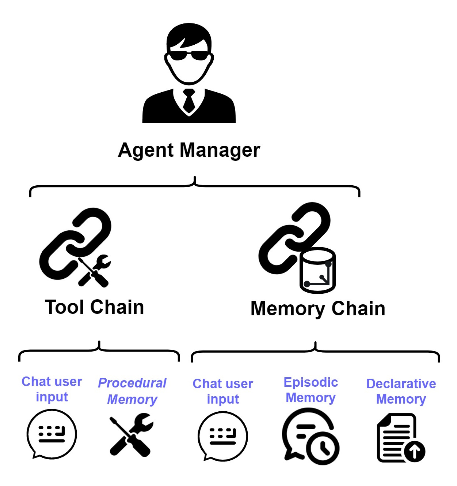

# Agent Manager

The Agent Manager is the Cat's component that manages the execution of language models [chains](https://docs.langchain.com/docs/components/chains/llm-chain).
A language model chain is a pipeline that takes one or more input variables, it formats them in a prompt,
submits the prompt to a language model and, optionally, parses the output.

The Cat's Agent Manager orchestrates two chains: 

1. the **tool chain**, which, in turn, is a component of the Tool Agent;
2. the **memory chain**.

When suitable tools for the task at hand are retrieved from the [procedural memory](../memory/long_term_memory.md),
the Agent Manager calls the Tool Agent to execute the tool chain; otherwise the memory chain is executed to answer the user's
question with the context retrieved from the episodic and declarative [memories](../memory/long_term_memory.md).

Specifically, the default execution pipeline is the following:

1. the Cat receives the user's message;
2. the Cat looks for relevant context in each memory collection (i.e. procedural, declarative and episodic) using the user's message as a query;
3. if meaningful context is retrieved from the procedural memory, the Tool Agent starts, otherwise the **memory chain** starts;
4. if executed, the Tool Agent provides an output. If the output answer the user's input, such output is returned to the user, otherwise the **memory chain** starts;
5. if executed, the **memory chain** provides the output using the context retrieved from the declarative and episodic memories.

## Tool Chain

Sometimes a simple answer from the [language model](../llm.md#completion-model) is not enough.
For this reason, the Cat can exploit a set of custom tools (e.g. API calls and Python functions) coming from the [plugins](../plugins.md).  
The decision on *whether* and *which* action should be taken to fulfill the user's request is delegated to an Agent, i.e. the Tool Agent.

The Tool Agent uses the language model to outline a "reasoning" and accomplish the user's request with the tools retrieved
from the Cat's [procedural memory](../memory/long_term_memory.md).
The tools selection and usage is planned according to a set of [instructions](../prompts/main_prompt.md#instructions).
Finally, the Tool Agent parses the formatting of the tool output.

## Memory Chain

The Memory Chain is a simple chain that takes the user's input and the context retrieved from the episodic and declarative
[memories](../memory/long_term_memory.md) and formats them in the [main prompt](../prompts/main_prompt.md). Such prompt
is submitted to the language model.

{width=600px}