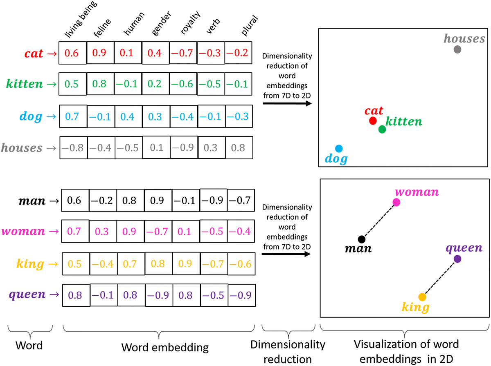
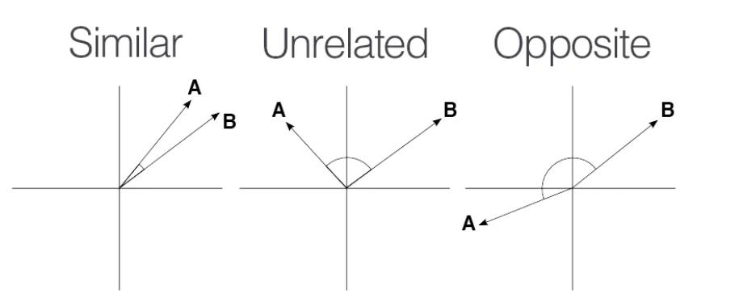

# Vector Memory

When we talk about Vector Memory we talk about Vector Database.
A Vector Database is a particular kind of DB that stores information in form of high-dimensional vectors called embeddings.
The embeddings are representations of text, image, sounds, ...

As Vector Memory the Cheshire-Cat using [Qdrant])(https://qdrant.tech/), the VectorDBs offer also optimized methods for information retrieval usually based on [Cosine similarity](https://en.wikipedia.org/wiki/Cosine_similarity). From wikipedia 

> *"Cosine similarity is a measure of similarity between two non-zero vectors defined in an inner product space. Cosine similarity is the cosine of the angle between the vectors; that is, it is the dot product of the vectors divided by the product of their lengths. It follows that the cosine similarity does not depend on the magnitudes of the vectors, but only on their angle."*

## Semantic Search

Semantic search seeks to improve search accuracy by understanding the content of the search query. The idea is to create an high-dimensional semantic space and at search time to find the nearest point (documents) to our questions.

To create the vectors you must use an [encoder](https://cheshire-cat-ai.github.io/docs/llm-concepts/encoder/), the vector are stored on the vector memory, when a query is done the encoder calculates its embedding, the VectorDB calculates the cosine similaity between query and stored points and the K nearest are returned.

### Search in high-dimensional spaces

Since the KNN is an algorithm whose performance degrades as the number of comparisons to be made increases, and since VectorDBs can contain as many as billions of vectors the technique used to efficiently find the closest points in high-dimensional spaces is usually [Approximate Nearest Neighbors](https://www.youtube.com/watch?v=DRbjpuqOsjk).