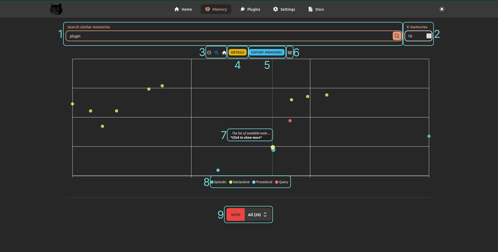

# Memory

The Memory page allows interacting with the Cat's [long term memory](../../../conceptual/memory/long_term_memory.md).
Specifically, it is possible to query the vector collections and retrieve a custom number of similar memories.

To plot the memories, the Cat uses an algorithm called t-distributed Stochastic Neighbor Embedding (t-SNE)[^1].
This is a dimensionality reduction algorithm commonly used to visualize high-dimensional points.
In short, t-SNE embeds the points projecting them on a 2D plane such that similar points live close to each other.
Namely, the most similar memories to the query are the closest points to the red one.  
Reducing the dimensionality of memories is necessary since memories are stored in the [vector memory](../../../conceptual/memory/vector_memory.md) collections
in the form of multidimensional [points](../../../conceptual/memory/vector_memory.md) (e.g. points with 1536 dimensions).

1. TODO
2.

[^1]: Van der Maaten, L., & Hinton, G. (2008). Visualizing data using t-SNE. Journal of machine learning research, 9(11).